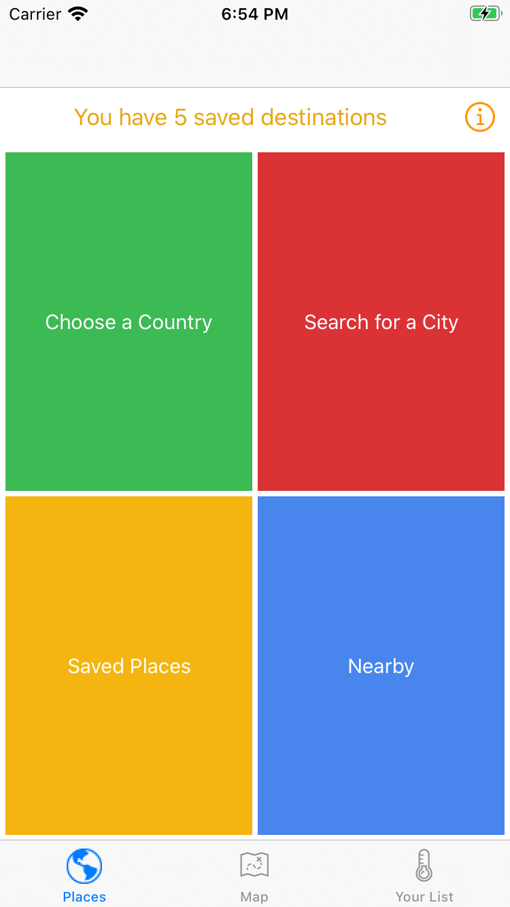
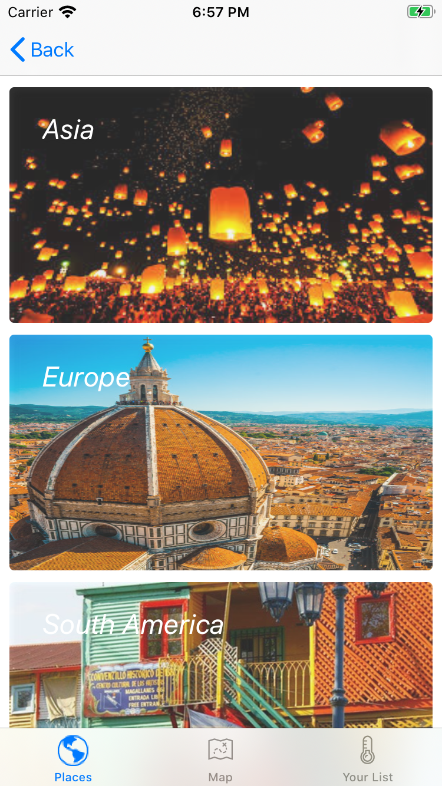
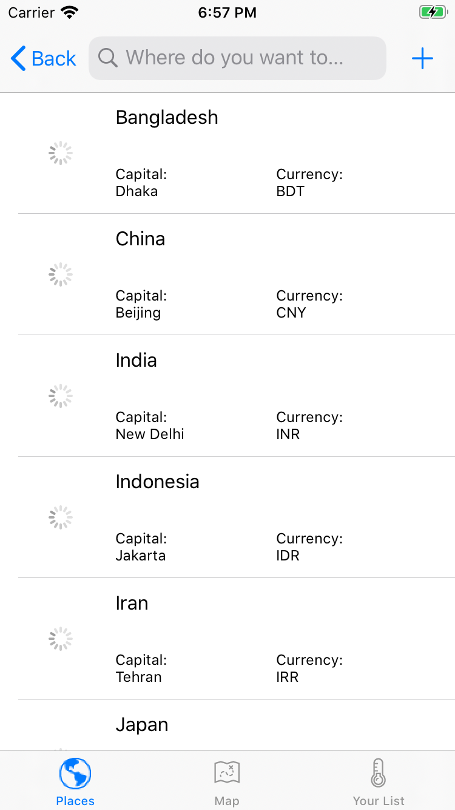
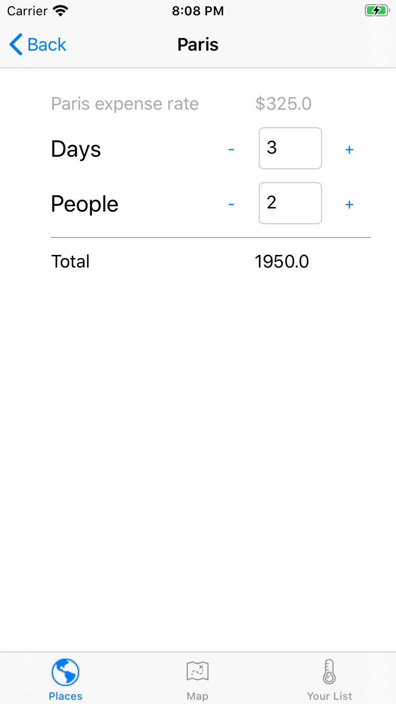
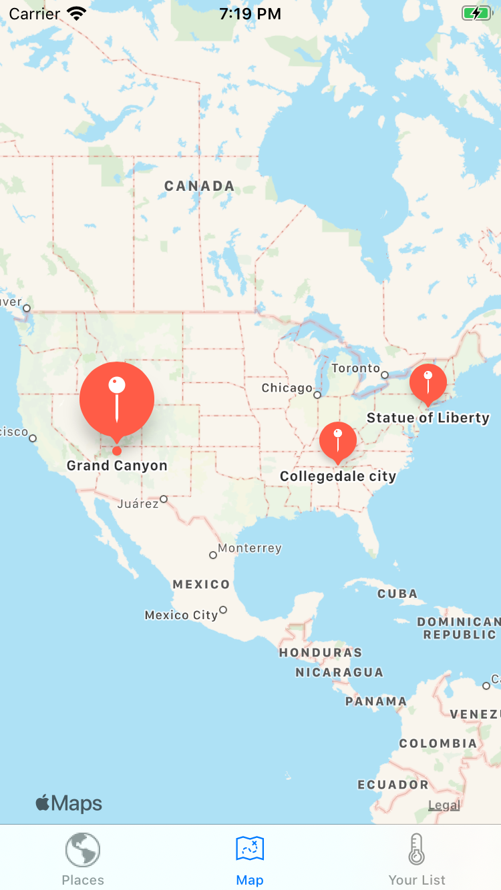

A traveling guide iOS app that helps travelers save time ⌚ and money 💵.

<br/>

## Technologies ⚙️
Xcode, Swift, MVC.

<h2>Main features</h2>



***1. Place***

4 options to choose a place:
- Choose a country: Choose countries by continent, then select cities 🌆.
- Search for a city: From the list of cities, search for a country/city.
- Saved places: Select cities from the places that are saved.
- Nearby 📍: Choose nearby places from the user's current location.

For each city, there will be information about the places to visit, events to attend, and food to try.

The app also helps users to have great financial preparations by suggesting the budget needed for the trip planned 🛫.

<br/>
<br/>
<br/>

***2. Map***

Showing the destinations (cities) that are "saved" 🌟 by the user.
```
Future implementations:
- Clicking on the destinations (markers) will show the details of those places
- Showing the suggested flight routes to travel to those destinations.
```

<br/>
3. Your list (Future implementation)
<br/>

<h2>Screenshots</h2>

<p float="left">
  
  
  
  
</p>
